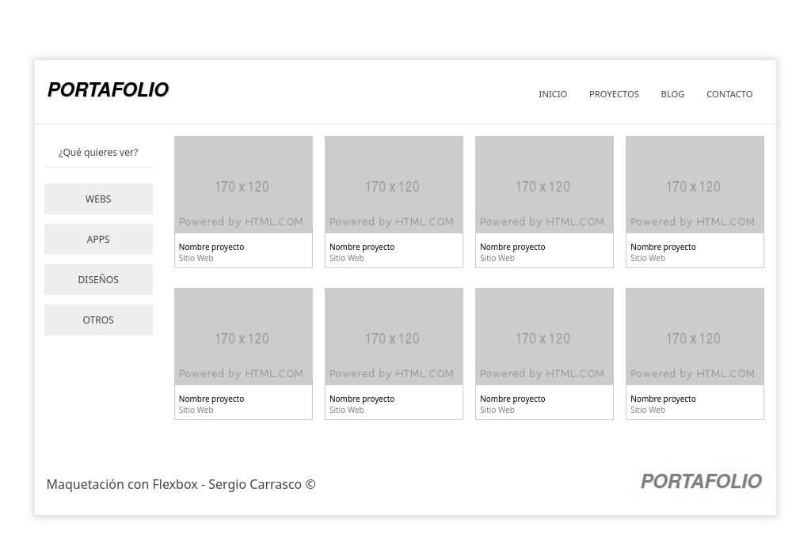
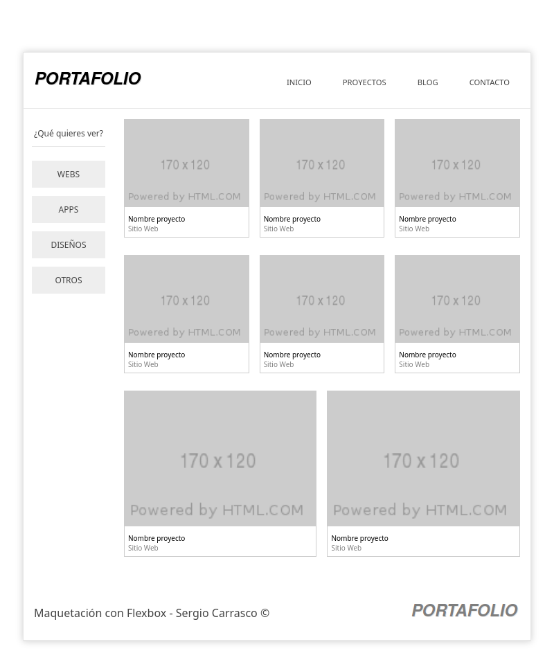
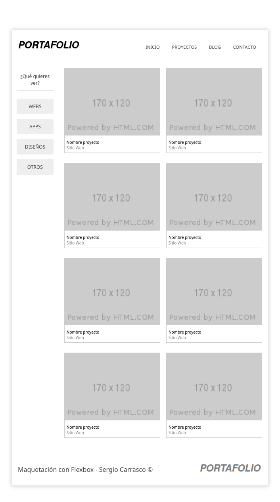
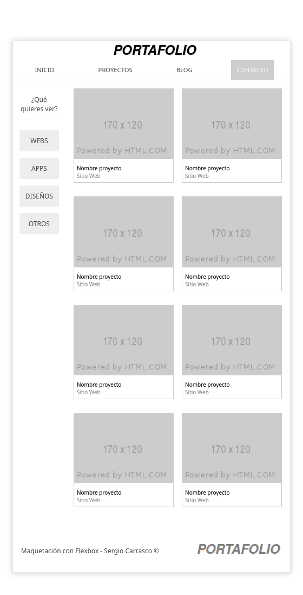
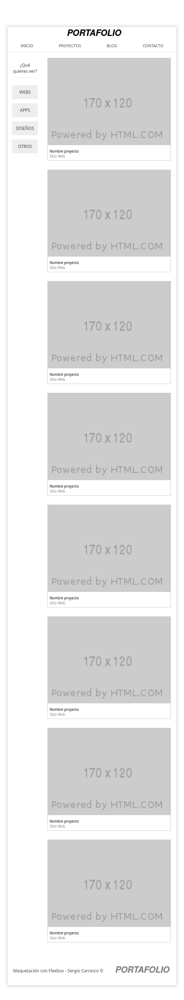
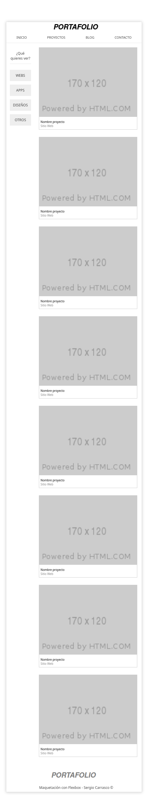
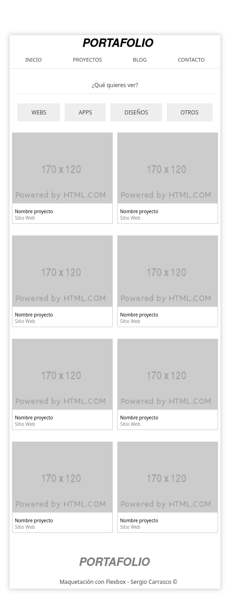
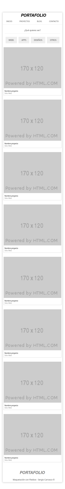
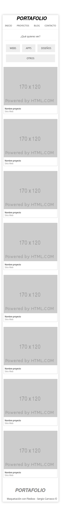

# Portfolio Flexbox Layout
---
## What is Portfolio Flexbox Layout? 🤔

It is a simple but effective responsive web design created from a jpg image. HTML5 and CSS3 are used, as well as Flexbox as the layout technology. It can serve as a basis for other more elaborate designs portfolios

---
## Technologies used 🛠️
- HTML
- CSS
- Visual Studio Code
- Git/Git Hub
---
## Do you want to see the application running? 🚀

 [Click here!](https://scarrasco85.github.io/portfolio-layout-flexbox/index.html)

---
 ## Responsive views - Some examples
#### Desktop view:

---
***

#### Medium view:

---
***

#### Medium-Small view:

---
***

#### Small view - 599px:

---
***

#### Small view 2 - 520px:

---
***

#### Small view 3 - 510px:

---
***

#### Small view 4 - 499px:

---
***

#### Small view 5 - 396px:

---
***

#### Small view 6 - 310px:

---
***